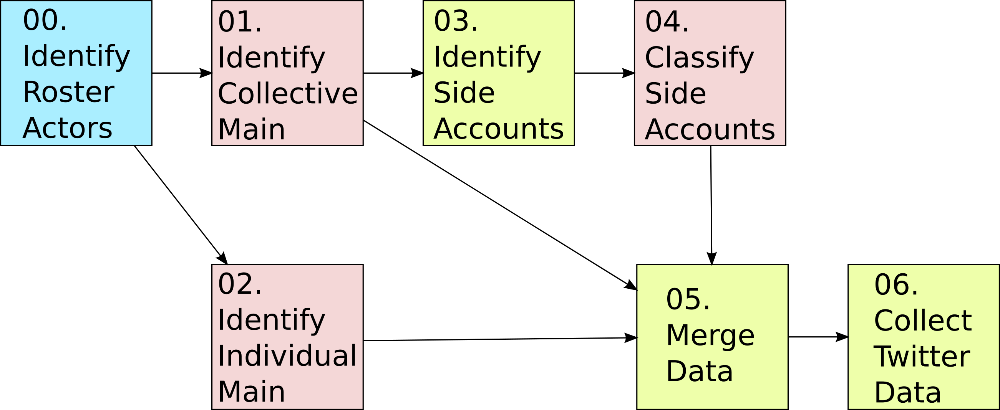

# componMultilayer
Repository for multilayer network approaches to working with climate governance data.

## Contents
- Protocol
- Summary of files

## Protocol
Details about data collection and labeling for each of the steps outline below can be found in the [`TwitterCodebook.pdf`](https://github.com/tedhchen/componMultilayer/blob/main/TwitterCodebook.pdf).

### 00. Identify roster actors
You should have a predefined list of policy actors. This protocol does not address how to bound policy systems and identify policy actors.

### 01. Identify collective main
In this step, you should find the collective main account of each of your policy actors and provide a list of keyword for filtering the side accounts. Document them in the template file (`template\main_accounts.csv`) and assign them with `level` 0.

### 02. Identify individual main
In this step, you should find the individual main accounts of each of your policy actors. Document them in the template file (`template\main_accounts.csv`) and assign them with `level` 1.

### --. Standardize formatting of main accounts
This step needs to be done before step 05. Doing it as early as possible after steps 01 and 02 will ensure the most consistent data (so accounts do not change their handles). Run the Jupyter Notebook `02_standardize_main.ipynb`. The output file will be used by a later step, but can be ignored for now.

### 03. Identify side accounts
Only do this step after `main_accounts.csv` has been filled with the collective main accounts and their keywords (step 01). Run the Jupyter Notebook `03_identify_sides.ipynb`. It will create coding sheets for each of your collective main accounts (as long as they have potential side accounts).

### 04. Classify side accounts
Only do this step after step 03 is complete. Go through each of the `check_[org].csv` file and classify the accounts based on instructions in the protocol file. Enter the level of the account in the 4th column and save the file. Collective side accounts are labeled 2, individual side accounts are labeled 3, and unrelated accounts are left blank.

### 05. Merge all levels
After all preceding steps are complete, run the Jupyter Notebook `05_levels_merge.ipynb`. This will create an output file `all_accounts.csv`, which contains all policy actors' accounts and their levels. We will use this to collect Twitter behavior of our policy actors.